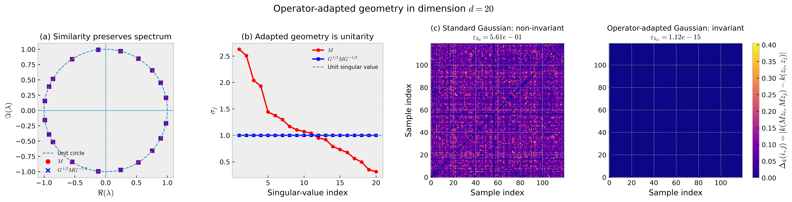

# Operator-Adapted Reproducing Kernel Geometries

[]()
[]()
[]()

Official repository accompanying:

## Operator-Adapted Reproducing Kernel Geometries for Structure-Preserving Representation Learning

**Himanshu Singh**  
Department of Meteorology and Atmospheric Science<br>
College of Earth and Mineral Sciences<br>
The Pennsylvania State University<br>
University Park, PA 16802

**Accepted at The Fortieth Annual Conference on Neural Information Processing Systems (NeurIPS 2026)**

---

## Overview

Representation learning typically begins by choosing or learning a geometry and then studying how transformations behave within that representation space. Our present work considers the inverse problem given as **given an operator, can we construct an reproducing kernel Hilbert space (RKHS) geometry in which that (linear) operator exactly preserves the representation structure?**

We develop a finite-dimensional theory of **operator-adapted reproducing kernel geometries**. The results characterize precisely when such an invariant geometry exists and describe the complete family of reproducing kernels that realize it. A key consequence is that an operator need not be unitary in its original geometry to become unitary after an appropriate change of RKHS geometry.

The theory further reveals that the freedom available in constructing these geometries is governed by the spectral structure of the operator, with eigenvalue multiplicities determining the degrees of freedom in the family of admissible kernels.

> **Core idea:** Rather than modifying an operator to respect a predetermined representation geometry, construct the geometry to respect the operator.

<p align="center">
  
</p>

### What does the figure show?

The figure provides a numerical illustration of the central idea in a 20-dimensional representation space.

**(a) The spectrum is already preserved.**  
The original operator has its eigenvalues on the unit circle. The operator adaptation does not modify these eigenvalues, emphasizing that the construction changes the **geometry of the representation space rather than the underlying spectral dynamics**.

**(b) Spectral stability does not imply geometric invariance.**  
Although the eigenvalues lie on the unit circle, the singular values of the original operator differ substantially from one. The operator is therefore not an isometry in the original Euclidean geometry. After adapting the geometry, all singular values collapse to one, showing that the same operator becomes exactly unitary in the adapted representation.

**(c) The standard Gaussian kernel does not preserve similarity.**  
Under the original geometry, applying the operator changes many pairwise kernel similarities. The resulting invariance-error map therefore contains substantial structure, with a normalized error of approximately **0.561**.

**(d) The operator-adapted Gaussian restores invariance.**  
After incorporating the invariant geometry into the Gaussian kernel, the pairwise discrepancies collapse to numerical precision, with an error of approximately **1.12 × 10⁻¹⁵**.

Taken together, the four panels demonstrate the main message of the paper: **an operator can be spectrally stable while still strongly distorting the geometry of a representation space. Instead of changing the operator, we can change the RKHS geometry so that the same dynamics become structure-preserving.**

---

## Paper

**Operator-Adapted Reproducing Kernel Geometries for Structure-Preserving Representation Learning**

Himanshu Singh  
The Pennsylvania State University

**NeurIPS 2026 — GlobalSouthAI**

The paper develops the existence and classification theory for operator-adapted RKHS geometries and demonstrates the construction through an operator-adapted Gaussian kernel.

---

## Citation

If you find this work useful, please cite:

```bibtex
@inproceedings{singh2026operatoradapted,
  title     = {Operator-Adapted Reproducing Kernel Geometries for
               Structure-Preserving Representation Learning},
  author    = {Singh, Himanshu},
  booktitle = {NeurIPS 2026 GlobalSouthAI},
  year      = {2026}
}
```

---

## License

This repository is released under the MIT License.
